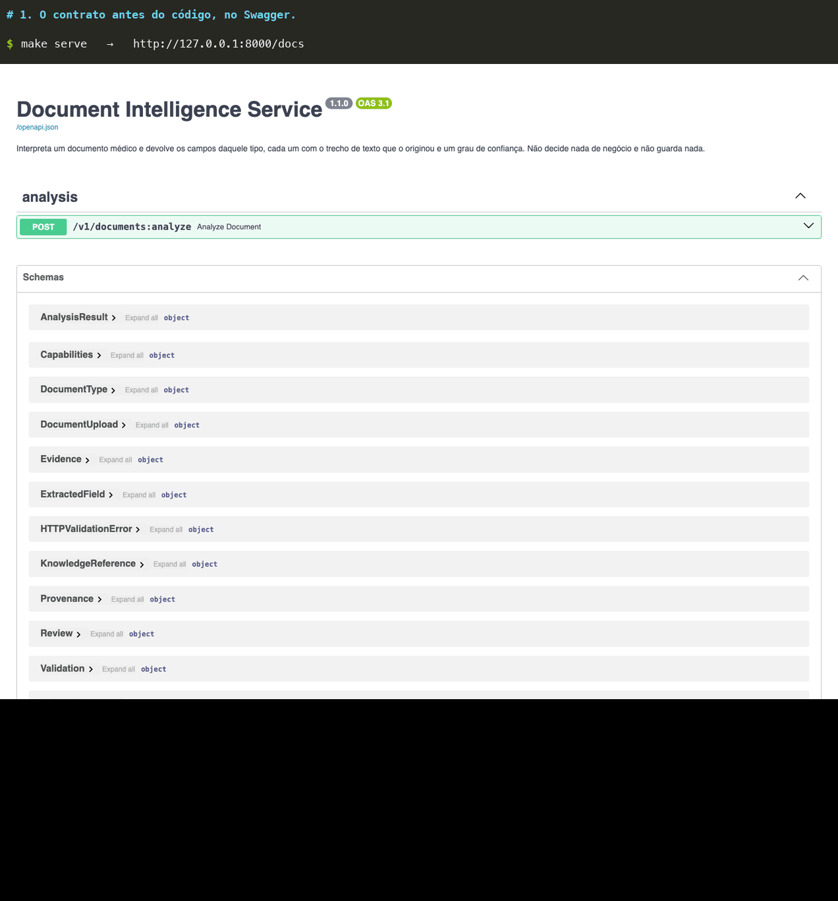

# Document Intelligence Service

Serviço desacoplado que interpreta documentos médicos e devolve dados estruturados, com confiança
e evidência por campo, e a indicação de quando o caso precisa de revisão humana.

Contexto: 500 documentos por dia, hoje lidos à mão em cerca de 15 minutos cada, o que equivale a
125 horas de trabalho humano por dia. O MVP cobre os dois tipos de maior volume, atestado médico e
resultado de avaliação médica.

Ele não decide nada de negócio, não tem interface, não guarda nada e não conhece o fluxo que o chama.
É síncrono e sem estado de propósito: quem precisa de assincronia envolve a peça, e o desenho de quem
envolve é diagrama na apresentação, não código daqui.



Perfil `fake`, com os documentos sintéticos de `samples/`. Para rever as cenas de terminal com pausa:
`uvx asciinema play docs/demo/demo.cast`.

## Onde mora o quê

Este repositório é a **peça de entrada e saída**. Ele recebe o arquivo, normaliza, escolhe a rota de
leitura, invoca, verifica que cada valor está ancorado em um trecho do documento, compõe a confiança,
decide se o caso precisa de uma pessoa e devolve o contrato.

O conhecimento e o raciocínio não moram aqui. O prompt, o schema de saída e o modelo são
configuração do Bedrock, em `config/bedrock.json`; a norma interna é o índice do Kendra; o catálogo
de tipos e as tabelas de valores válidos são `config/catalog.json`. Os três mudam sem release deste
serviço, e o desenho e a avaliação do modelo são trabalho próprio, fora deste repositório.

O que este repositório garante são **os testes e o contrato**. Rede, autorizador, plano de uso e
região são premissa de implantação: não estão aqui e nenhum teste daqui as prova.

## Estado

O MVP roda ponta a ponta nos dois tipos documentais, sem credencial, pelo perfil `fake`.

| | |
| --- | --- |
| Suíte | 204 testes unitários e de contrato, sem AWS nem credencial |
| Cobertura do núcleo | 100%, portão em 90% |
| Requisitos com teste | RF-01 a RF-22, RNF-04 a RNF-07, RNF-09 |
| Perfil `fake` | stubs que respondem a partir do gabarito. Provam ligação e formato, **não** qualidade |
| Perfil `aws` | `TextractOcr`, `BedrockLlm` e `KendraRetriever`, testados com `botocore.Stubber`, cada um com timeout e retentativa declarados. Nunca rodados contra uma conta |
| Portão de avaliação | baseline congelada em `evals/baseline.json`, tolerância de 2 pontos, roda no CI |

O que **não** está provado, dito antes que perguntem: qualidade de extração, custo, latência em
nuvem e permissão. Nenhuma dessas quatro coisas um dublê prova, e a avaliação no perfil `fake` mede
regressão de integração, não qualidade de modelo, porque os dublês devolvem o próprio gabarito.

## O que a peça expõe

**Um endpoint.** A peça recebe um documento e devolve a descrição dele. Não há segundo verbo, não há
recurso criado, não há nada para consultar depois — e essa superfície mínima é o que torna a política
de retenção uma frase verificável em vez de uma promessa.

### `POST /v1/documents:analyze`

Recebe **um** arquivo em `multipart/form-data` e devolve os dados estruturados dele.

| | |
| --- | --- |
| Entrada | `file`: PDF, JPEG, PNG ou HEIC, até 4 MB. **É o único campo**, e não há cabeçalho de correlação |
| Saída | `200` com a análise completa, ou `application/problem+json` com código estável |
| Efeito colateral | nenhum. A operação é pura: o mesmo arquivo devolve a mesma resposta e nada é guardado |

O que ele faz, em ordem: detecta o formato pelos bytes (a extensão nunca decide nada), converte HEIC
para JPEG, corrige rotação, mede qualidade e **recusa antes de qualquer chamada paga** se o documento
for ilegível. Escolhe a rota de leitura pelo sinal encontrado — PDF com camada de texto nem chama o
OCR. Classifica o tipo; se não for um dos suportados, recusa em vez de tentar extrair campos que o
documento não tem. Extrai os campos daquele tipo, **verifica em código que o trecho citado por cada
valor existe mesmo no texto lido**, roda as validações determinísticas, compõe uma confiança por
campo, busca a norma interna aplicável e decide se o caso precisa de uma pessoa.

A resposta carrega: o tipo com confiança própria, um objeto por campo com valor, confiança, evidência
e motivo de abstenção, a lista de validações, a norma citada com origem e versão, o bloco de revisão
com motivos em código estável, o que estava indisponível na chamada, e a proveniência que torna a
análise reproduzível.

**O que ele nunca faz:** decidir negócio. Não aprova, não defere, não conclui elegibilidade, não
infere campo ausente e não preenche no chute.

### Erros

Formato único, `application/problem+json`. O `code` é contrato e o consumidor roteia por ele; `title`
e `detail` são texto e podem mudar. O catálogo é arquivo, `contracts/v1/errors.yaml`, e um teste falha
se o código Python e o catálogo publicado discordarem.

| Código | HTTP | Retentável | Quando |
| --- | --- | --- | --- |
| `invalid_input` | 400 | não | corpo malformado, mídia não aceita, ou acima de 4 MB, com `limit_bytes` |
| `unsupported_document_type` | 422 | não | foi lido e não é nenhum tipo do catálogo |
| `document_quality_too_low` | 422 | não | ilegível, recusado antes de qualquer chamada paga |
| `rate_limited` | 429 | sim | limite de taxa, próprio ou repassado da dependência |
| `internal_error` | 500 | não | falha não prevista; nunca carrega conteúdo do documento |
| `upstream_unavailable` | 503 | sim | dependência obrigatória fora, sem degradação possível |
| `upstream_timeout` | 504 | sim | dependência estourou o tempo declarado |

### Linha de comando

Mesmo pipeline, mesma saída, sem subir servidor: `make analisar FILE=<caminho>`. Existe para a
demonstração e para depurar um documento sem Swagger.

## Arquitetura, em uma tela

```
serverless.yml          uma função por caso de uso. Hoje: analyze
  └─ Dockerfile         imagem, construída do uv.lock
       └─ src/
            entrypoints/   http, lambda, cli, composition root   ← conhece tudo
            adapters/      aws/ e fakes/                         ← conhece usecases e core
            usecases/   caso de uso e ports                   ← conhece core
            core/          regras puras                          ← não conhece ninguém
```

**As dependências apontam para dentro, e quem cobra é o `import-linter` no CI, não o revisor.** Regra
que só está escrita não é cumprida.

### Como isso escala num time

A camada é a unidade de posse, e as três frentes abaixo não se tocam — cada uma tem um teste que a
prova sem depender das outras.

| Frente | Mexe em | Prova sozinha com |
| --- | --- | --- |
| Regra de negócio | `core/` | teste unitário, sem rede e sem dublê de nuvem |
| Integração com serviço | `adapters/aws/` | `botocore.Stubber` |
| Borda e contrato | `entrypoints/`, `contracts/v1/` | teste de contrato contra o schema publicado |

Uma quarta frente não mexe em código nenhum. Quem cuida dela não abre o repositório de código
para trabalhar:

| Arquivo | O que decide | Quem é dono |
| --- | --- | --- |
| `config/catalog.json` | tipos documentais, campos, tabelas de valores válidos | Saúde Ocupacional |
| `config/bedrock.json` | modelo, prompts, versão de prompt, versão do guardrail | Saúde Ocupacional e Engenharia |
| `config/guardrails.json` | a política que o Bedrock aplica, na forma do `CreateGuardrail` | Saúde Ocupacional |
| `config/kendra.json` | índice, fonte de dados, e o filtro que exclui norma revogada | Engenharia |
| `knowledge/normas.json` | o corpus ingerido no índice | Saúde Ocupacional |

Identificador de recurso não está em nenhum deles: índice do Kendra e guardrail variam por conta e
entram por variável de ambiente na implantação. O que fica em configuração é a governança — a
versão do guardrail, o filtro da consulta — que é a mesma em toda conta depois de promovida.

### Como cresce

| O que muda | O que se faz |
| --- | --- |
| Tipo documental novo | entrada em `config/catalog.json`, mais uma versão de contrato pelo nome do tipo |
| Função nova | entrada em `functions:` no `serverless.yml`, apontando para outro handler em `entrypoints/`. As camadas abaixo são compartilhadas e não se reorganizam |
| Provedor de OCR, modelo ou conhecimento | adapter novo atrás do port que já existe. O domínio não sabe que trocou |
| Norma nova ou revisada | ingestão no índice. Nenhuma release do serviço |

O que **não** cresce por adição: contrato publicado e política de retenção. Os dois são decisão, e
mudam por ADR.

## Por onde começar a ler

Três caminhos, conforme o tempo disponível.

**Cinco minutos, para entender a decisão central:** `docs/PRD.md` §3 (por que a peça é síncrona e
sem estado) e `contracts/v1/openapi.yaml` (o contrato, que é o produto).

**Vinte minutos, para avaliar o desenho:** os quatro abaixo, nesta ordem.

| Arquivo | A pergunta que ele responde |
| --- | --- |
| `docs/PRD.md` | o que o produto é, em 22 requisitos numerados e testáveis |
| `docs/PRD-MVP.md` | o que entra na primeira entrega, e por que o resto fica de fora |
| `docs/sdlc.md` | o que do ciclo de vida está **aplicado** aqui, e o que é desenho |
| `docs/guia-do-codigo.md` | o que é cada peça do código, por que existe e o que quebra sem ela |
| `docs/case-roteiro.md` | o roteiro da apresentação, cobrindo os sete entregáveis |

**O resto, por assunto:**

| Arquivo | O que tem dentro |
| --- | --- |
| `docs/stack.md` | dependências, serviços da AWS, perfis, dublês e o que cada nível de teste prova |
| `docs/adr/` | as decisões irreversíveis, com a alternativa descartada em cada uma |
| `specs/` | uma spec por fatia, com regras numeradas e os testes que as provam |
| `AGENTS.md` | as regras do repositório; `CLAUDE.md` só aponta para ele |
| `contracts/v1/` | OpenAPI, schema da resposta, catálogo de erros |
| `serverless.yml`, `Dockerfile` | implantação: função, rota, rede e permissão mínima. Declarado e revisado em leitura, **nunca aplicado** |
| `config/` | catálogo de tipos e configuração do modelo: o conteúdo que não é código |
| `knowledge/` | o corpus de normas que seria ingerido no Kendra, com dono, versão e vigência |
| `samples/` | o gerador do conjunto de referência e o gabarito. Os documentos são artefatos de build, reconstruídos com `make fixtures` |

## Como rodar

```bash
make install      # dependências, conjunto de referência e o hook que roda `make ci` antes de cada push
make ci           # lint, tipos, camadas, testes e cobertura, sem AWS e sem credencial
make demo         # analisa um atestado e imprime a resposta
make serve        # sobe a API com Swagger em http://127.0.0.1:8000/docs
make eval         # regressão sintética nos 7 casos contra a baseline, com relatório
```

`make help` lista todos os alvos. O perfil padrão é `fake` e não custa nada. `DIS_PROFILE=aws` exige
conta, um índice do Kendra em `DIS_KENDRA_INDEX_ID`, um guardrail em `DIS_BEDROCK_GUARDRAIL_ID` e
gasta dinheiro. Faltando qualquer um dos dois o serviço **recusa subir**: análise sem índice deixa
de ser fundamentada em norma, e análise sem guardrail é pior do que indisponibilidade.

## Aviso sobre os documentos em `samples/`

Todos os documentos são inteiramente sintéticos, gerados por `samples/gerar_sinteticos.py`. Nomes,
CPF, CNPJ, CRM, CNES e endereços são fictícios, os números de registro profissional são inválidos
de propósito, a URL de validação aponta para um domínio inexistente e cada arquivo carrega no rodapé
uma marca de documento de teste sem validade legal.

O layout usa como referência de estrutura de campos os modelos públicos do Conselho Federal de
Medicina utilizados na Prescrição Eletrônica, e o conteúdo mínimo do ASO definido pela NR-7,
item 7.5.19.1.

Nenhum documento real, dado pessoal real ou informação interna de qualquer organização foi usado
neste repositório.

## Licença

MIT. Veja `LICENSE`.
